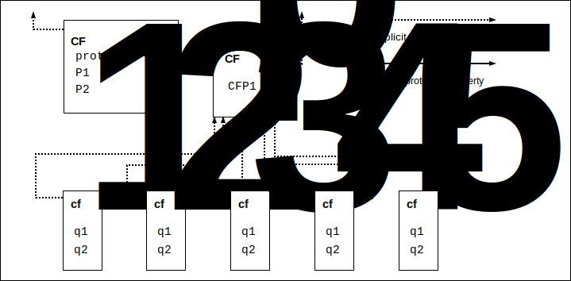

本节包含对ECMAScript语言非规范性的概述。

ECMAScript是一种在宿主环境中执行计算并处理计算对象的面向对象编程语言。这里的ECMAScript 并不是计算性自完备的；事实上，本规范并没有规定外部数据输入和计算结果输出。相反，我们期望ECMAScript程序的计算环境不仅提供本规范中描述的对象和其他设施，还能提供某些特定环境下的宿主对象；除非为了说明宿主对象可能提供某些属性和方法以供ECMAScript程序访问，这些宿主对象描述和行为都超出了本规范的范围。

**脚本语言**是一种用于操作、自定义、自动化现有系统设施的编程语言。在这种系统中，用户已经可以通过一个用户界面使用可用功能，脚本语言正是暴露这些有用功能给程序控制的一种机制。这样，现有系统可以说是提供了对象和设施的一种宿主环境，以完善脚本语言能力。因此，设计脚本语言时，就考虑到了可被专业和非专业程序员都能使用。

ECMAScript最初被设计为**Web脚本语言**，提供一种机制，使浏览器中的网页更加活跃，使基于Web的客户端/服务器架构能够执行服务器计算。ECMAScript 可以为各种宿主环境提供核心的脚本功能，因此本文档为不依赖特定宿主环境的核心脚本语言作出规范。

ECMAScript的一些机能和其他编程语言的类似；特别是下列文献所描述的JavaTM、Self和Scheme：

-   Gosling, James, Bill Joy and Guy Steele. The JavaTM Language Specification. Addison Wesley Publishing Co., 1996.
-   Ungar, David, and Smith, Randall B. Self: The Power of Simplicity. OOPSLA '87 Conference Proceedings, pp. 227–241, Orlando, FL, October 1987.
-   IEEE Standard for the Scheme Programming Language. IEEE Std 1178-1990.

## Web脚本语言

Web浏览器为增加客户端的计算能力而引入ECMAScript宿主环境；例如，它提供的对象有：window、menu、pop-up、dialog box、text area、anchor、frame、history、cookie和input/output等等。进一步来说，Web浏览器所提供的这种宿主环境可以让脚本代码处理诸如改变焦点、页面和图片的加载、卸载、错误和终止、选择、表单提交以及鼠标交互等事件。脚本代码出现在HTML中，显示出来的页面则是一个由用户接口元素、已确定计算出来的文本以及图片所组成的集合。脚本代码根据用户交互做出反应，所以并不需要主程序。

Web服务器为增加服务端的计算能力而提供了完全不同的宿主环境；其所提供的对象有：requrest、client、file，以及数据锁定和分享机制。综合使用浏览器端和服务器端脚本代码，则可在为基于Web的应用程序提供可定制的用户接口的同时，将计算分布到客户端和服务端进行。

每一种支持ECMAScript的Web浏览器和服务器都将其自身的宿主环境作为ECMAScript的补充，使得ECMAScript的执行环境变得愈发完整。

## 语言概述

本节是非正式的ECMAScript概述 --- 仅描述该语言的部分内容。本概述不是标准的一部分。

ECMAScript是基于对象的：基本语言和宿主设施都由对象提供，ECMAScript程序是一组可通信的对象。ECMAScript<b title="objects">对象</b>是<b title="properties">属性</b>的集合，每个属性有零或多个[特性](ES5/types#property-attributes "wikilink")，这些特性决定了属性的使用方式。例如，当设置一个属性的[Writable](ES5/types#table5-Writable "wikilink")特性为**false**时，任何试图更改此属性值的ECMAScript代码都会执行失败。属性是个容器，它可以存放其他<b title="objects">对象</b>、<b title="primitive values">原始值</b>、<b title="functions">函数</b>。原始值是下列内置类型之一的成员：[Undefined](ES5/types#Undefined "wikilink")、[Null](ES5/types#Null "wikilink")、[Boolean](ES5/types#Boolean "wikilink")、[Number](ES5/types#Number "wikilink")、[String](ES5/types#String "wikilink")；对象是其余的内置类型[Object](ES5/types#Object "wikilink")的成员；函数是<b title="callable object">可调用的对象</b>。<b title="method">方法</b>是通过属性与对象关联的函数。

ECMAScript定义了一组<b title="built-in objects">内置对象</b>，用以完善ECMAScript实体的定义。这些内置对象包括[全局对象](ES5/builtins#x15.1 "wikilink")、[Object对象](ES5/builtins#x15.2 "wikilink")、[Function对象](ES5/builtins#x15.3 "wikilink")、[Array对象](ES5/builtins#x15.4 "wikilink")、[String对象](ES5/builtins#x15.5 "wikilink")、[Boolean对象](ES5/builtins#x15.6 "wikilink")、[Number对象](ES5/builtins#x15.7 "wikilink")、[Math对象](ES5/builtins#x15.8 "wikilink")、[Date对象](ES5/builtins#x15.9 "wikilink")、[RegExp对象](ES5/builtins#x15.10 "wikilink")、[JSON对象](ES5/builtins#x15.12 "wikilink")和[Error对象](ES5/builtins#x15.11 "wikilink")：[Error](ES5/builtins#Error "wikilink")、[EvalError](ES5/builtins#EvalError "wikilink")、[RangeError](ES5/builtins#RangeError "wikilink")、[ReferenceError](ES5/builtins#ReferenceError "wikilink")、[SyntaxError](ES5/builtins#SyntaxError "wikilink")、[TypeError](ES5/builtins#TypeError "wikilink")、[URIError](ES5/builtins#URIError "wikilink")。

ECMAScript还定义一组内置<b title="operators">运算符</b>。ECMAScript运算符包括[一元运算符](ES5/expressions#x11.4 "wikilink")、[乘法运算符](ES5/expressions#x11.5 "wikilink")、[加法运算符](ES5/expressions#x11.6 "wikilink")、[位移运算符](ES5/expressions#x11.7 "wikilink")、[关系运算符](ES5/expressions#x11.8 "wikilink")、[等值运算符](ES5/expressions#x11.9 "wikilink")、[二元按位运算符](ES5/expressions#x11.10 "wikilink")、[二元逻辑运算符](ES5/expressions#x11.11 "wikilink")、[赋值运算符](ES5/expressions#x11.13 "wikilink")、[逗号运算符](ES5/expressions#x11.14 "wikilink")。

ECMAScript语法有意设计成与Java类似的语法。ECMAScript语法是松散的，意在成为一种易于使用的脚本语言。例如，变量既不需要类型声明，也不需要类型关联属性；定义的函数也不需要在函数调用前进行声明。

### 对象

ECMAScript不使用诸如C++、Smalltalk、Java中的类。相反，可以通过各种方式创建对象，包括字面量符号和**构造器**来创建对象然后运行代码初始化其全部或部分属性值。构造器是拥有一个名为“**prototype**”属性的函数。prototype属性用于实现<b title="prototype-based inheritance">原型继承</b>和<b title="shared properties">共享属性</b>。构造器使用**new**表达式创建对象：例如，**new Date(2009,11)**创建了一个新的**Date**对象。不使用**new**来调用构造器，其结果依赖于构造器本身。例如，**Date()**产生一个表示当前日期时间的字符串，而不是一个对象。

每个由构造器创建的对象都有一个隐式引用（谓之对象的原型）链接到构造器的“**prototype**”属性的值 。再者，原型可能有一个<b title="non-null">非空</b>隐式引用链接到它自己的原型，以此类推；此之谓<b title="prototype chain">原型链</b>。当一个引用被链接到对象的属性上时，该引用会指向原型链中第一个包含此属性名的对象所对应的属性。换句话说，首先直接检查对象内同名属性，如果对象包含同名的属性，引用即指向此属性；如果该对象不包含同名的属性，则下一步检查对象的原型，以此类推。

通常在基于类的面向对象语言中，实例拥有状态，类拥有方法，并且只能继承结构和行为。在ECMAScript中，对象拥有状态和方法，并且可以继承结构、行为和状态。

所有不直接包含其原型中所包含的特定属性的对象都会共享此属性及其属性值。**图1**说明了这一点：

<var>CF</var>是一个构造器（也是一个对象）。用**new**表达式创建的5个对象：<var>cf1</var>、<var>cf2</var>、<var>cf3</var>、<var>cf4</var>、<var>cf5</var>。每个对象都有名为<var>q1</var>和<var>q2</var>的属性。虚线表示隐式原型关系；例如：<var>cf3</var>的原型是<var>CFp</var>。构造器<var>CF</var>有名为<var>P1</var>和<var>P2</var>的两个属性；这两个属性对<var>CFp</var>、<var>cf1</var>、<var>cf2</var>、<var>cf3</var>、<var>cf4</var>、<var>cf5</var>都是不可见的。<var>CFp</var>有名为<var>CFP1</var>的属性，该属性和任何在<var>CFp</var>的隐式原型链中能找到且不是<var>q1</var>、<var>q2</var>、<var>CFP1</var>的属性都能被<var>cf1</var>、<var>cf2</var>、<var>cf3</var>、<var>cf4</var>、<var>cf5</var>所共享（但不被<var>CF</var>共享）。请注意<var>CF</var>和<var>CFp</var>之间没有隐式原型链接。

不同于基于类的对象语言，属性可以通过赋值的方式动态地添加给对象。换言之，构造器并非要对所构造对象的全部或任何属性进行命名或赋值。上图中，可通过给<var>CFp</var>添加新属性值的方式来为<var>cf1</var>、<var>cf2</var>、<var>cf3</var>、<var>cf4</var>、<var>cf5</var>添加一个新的共享属性。

### ECMAScript的严格模式变体

ECMAScript语言认为存在部分用户希望限制该语言中的某些功能。用户这样做可能是基于安全考虑，以规避那些他们认为容易出错的功能，从而获得更严格的错误检查，抑或是基于其他原因考虑。为了支持这种可能，ECMAScript定义了该语言的严格模式变体。这种语言严格模式变体，去除了ECMAScript语言中某些特定的语法和语义特征，还修改了某些功能的详细语义。严格模式变体还增添了一些必须抛出错误异常报告的错误条件，而在非严格的语言模式下这些条件不属于错误。

ECMAScript的严格模式变体通常被称为该语言的<b title="strict mode">严格模式</b>。严格模式选择使用ECMAScript严格模式的语法和语义，明确地适用于单个ECMAScript[代码单元级别](ES5/source#code-unit "wikilink")。由于严格模式适用于选择的语法代码单元级别，严格模式只会在这个代码单元内施加带有局部效果的限制。严格模式并不在语义层面限制或修改任何必须在多个代码单元运行的ECMAScript代码。一个完整ECMAScript程序可由严格模式和非严格模式的代码单元组成。在这种情况下，严格的模式只适用于[严格模式代码单元内实际执行的代码](ES5/execution#x10.1.1 "wikilink")。

为了符合本规范，ECMAScript的实现必须实现本规范所规定的非严格模式ECMAScript语言和ECMAScript语言严格模式变体。此外，实现必须支持一个由非严格模式和严格模式代码单元所组合成的复合程序。

## 术语定义

本文档将使用下列术语和定义。

### 类型

本规范 [第8章](ES5/types "wikilink") 定义数据的集合。

### 原始值

在本规范的 [第8章](ES5/types "wikilink") 定义的 **Undefined**、**Null**、**Boolean**、**Number**、**String** 类型之一的成员。

### 对象

对象类型的成员。

### 构造器

创建和初始化对象的函数对象。

### 原型

为其他对象提供共享属性的对象。

### 原生对象

ECMAScript 实现中完全由本规范定义其语义而不掺入任何宿主环境定义的对象。

### 内置对象

由 ECMAScript 实现提供，独立于宿主环境的对象，ECMAScript 程序开始执行时就存在。

### 宿主对象

由宿主环境提供的对象，用于完善 ECMAScript 执行环境。

### undefined 值

说明一个变量没有被分配值的一个原始值。

### Undefined 类型

**undefined** 值是 '''Undefined ''' 类型绝无仅有的一个值。

### null 值

代表对象值故意留空的一个原始值。

### Null 类型

**null** 值是 **Null** 类型绝无仅有的一个值。

### Boolean 值

**Boolean** 类型的成员。

### Boolean 类型

由原始值 **true** 和 **false** 组成的类型。

### Boolean 对象

**Object** 类型的成员，它是标准内置构造器 [Boolean](ES5/builtins#x15.6 "wikilink") 的实例。

### String 值

原始值，它是零个或多个16位无符号整数组成的有限有序序列。

### String 类型

所有可能的 **String** 值的集合。

### String 对象

**Object** 类型的成员，它是标准内置构造器 [String](ES5/builtins#x15.5 "wikilink") 的实例。

### Number 值

原始值，对应一个64位双精度二进制 IEEE754 值。

### Number 类型

所有可能的数字值的集合，包括特殊的“Not-a-Number”(**NaN**) 值、正无穷、负无穷。

### Number 对象

对象类型的成员，它是标准内置构造器 [Number](ES5/builtins#x15.7 "wikilink") 的一个实例。

### Infinity

正无穷 **Number** 值。

### NaN

值为 IEEE 754“Not-a-Number”的 **Number** 值。

### 函数

**Object** 类型的成员，标准内置构造器 [Function](ES5/builtins#x15.3 "wikilink") 的一个实例，并且可作为<b title="subroutine">子程序</b>被调用。

### 内置函数

属于**函数**的内置对象。

### 属性

一个名称和一个值之间的关联；属性本身是对象的一部分。

### 方法

作为属性值的函数。

### 内置方法

属于内置函数的方法。

### 特性

用于定义属性的一些特征的内部值。

### 自身属性

对象直接拥有的属性。

### 继承属性

不是对象的自身属性，但是对象原型的属性（可以是自身或继承的）。

